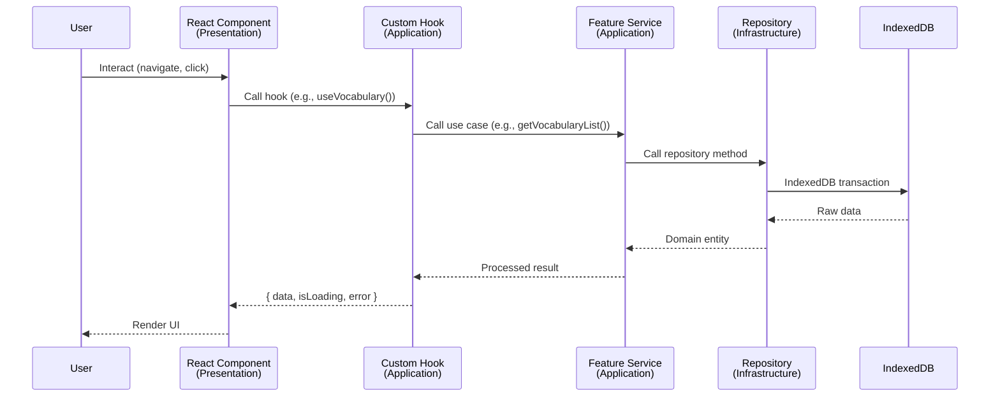
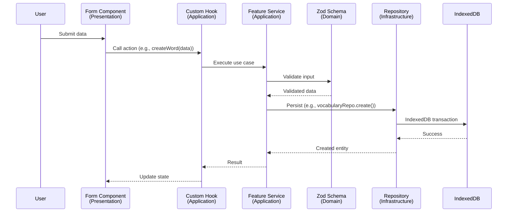
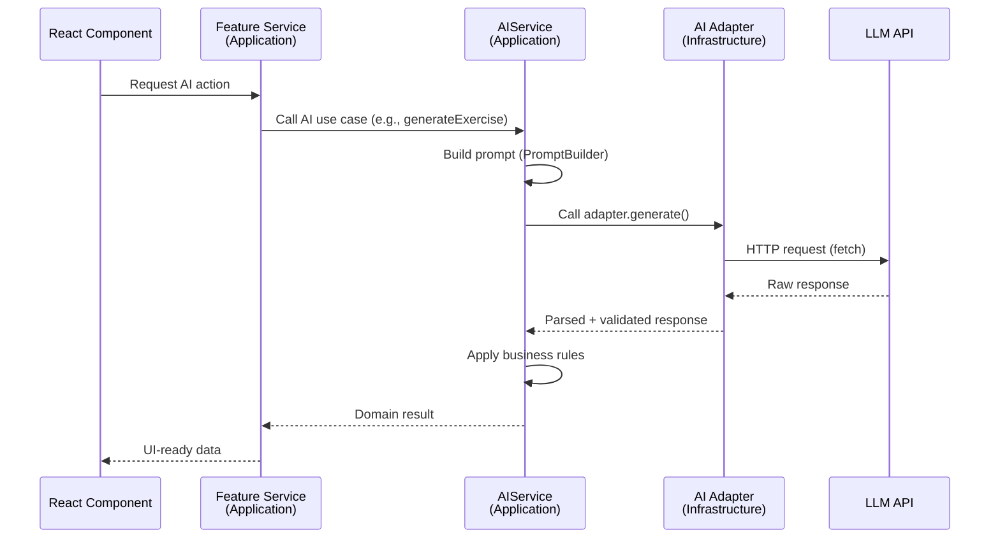
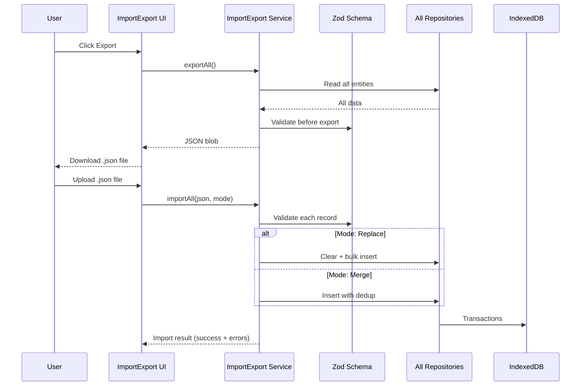

# IELTS Journey — Architecture

> The clean architecture of the IELTS Journey codebase.  
> This document describes the architecture layers, folder structure, dependency rules, and data flows.

---

## Table of Contents

1. [Architecture Overview](#1-architecture-overview)
2. [Clean Architecture Layers](#2-clean-architecture-layers)
3. [Folder Structure](#3-folder-structure)
4. [Layer Mappings](#4-layer-mappings)
5. [Dependency Rules](#5-dependency-rules)
6. [Data Flow](#6-data-flow)
7. [Key Design Patterns](#7-key-design-patterns)
8. [Module Dependency Graph](#8-module-dependency-graph)
9. [Adding a New Feature](#9-adding-a-new-feature)

---

## 1. Architecture Overview

The project uses **Clean Architecture** with four distinct layers, organized as a **monorepo** with pnpm workspaces.

```
┌─────────────────────────────────────────────────────────┐
│                    PRESENTATION LAYER                    │
│  React Components · Pages · Widgets · Popups            │
│  (features/*, apps/web, apps/extension/popup)           │
├─────────────────────────────────────────────────────────┤
│                    APPLICATION LAYER                     │
│  Use Cases · Feature Services · Commands · Workflows    │
│  (features/*/services/, features/*/hooks/)              │
├─────────────────────────────────────────────────────────┤
│                     DOMAIN LAYER                         │
│  Entities · Business Rules · Value Objects · Interfaces │
│  (packages/types, packages/learning-engine)             │
├─────────────────────────────────────────────────────────┤
│                   INFRASTRUCTURE LAYER                   │
│  IndexedDB Repos · AI Adapters · Browser APIs           │
│  (packages/storage, packages/ai, apps/extension/*)      │
└─────────────────────────────────────────────────────────┘
```

**Core principles:**

| Principle | Application |
|-----------|-------------|
| **Dependency Inversion** | Domain and Application layers depend on abstractions (interfaces), not concrete implementations |
| **Separation of Concerns** | Each layer has a single responsibility |
| **Local-First** | All data stays in the browser. No backend. |
| **Feature-Based Modularity** | Features are self-contained modules within Presentation + Application layers |
| **Repository Pattern** | Data access goes through repository interfaces |
| **Adapter Pattern** | AI providers are swappable via adapters |
| **Strategy Pattern** | Exercise scoring, generation, and review scheduling are pluggable strategies |

---

## 2. Clean Architecture Layers

### 2.1 Presentation Layer

**Responsibility:** Render UI, capture user input, display state.

**Contains:**
- React components (pages, widgets, forms)
- UI state management (local state, context providers)
- Feature entry components
- Layout components (sidebar, header, mobile nav)
- Shared UI primitives (buttons, cards, modals, toasts)

**Rules:**
- NO direct database calls
- NO direct AI API calls
- NO business logic
- Call Application Layer services through hooks or service calls
- Only import from Application Layer or Domain Layer (types)

**Folders:**
```
features/*/components/   ← Feature-specific UI
apps/web/src/             ← Web app pages, routing, root providers
apps/extension/src/popup/ ← Extension popup UI
apps/extension/src/options/ ← Extension options UI
packages/ui/              ← Shared UI component library
packages/theme/           ← Design tokens, CSS variables
```

### 2.2 Application Layer

**Responsibility:** Orchestrate use cases, coordinate domain objects, manage workflows.

**Contains:**
- Feature services (orchestrate domain + infrastructure)
- Custom React hooks (bridge between UI and services)
- Use case functions (pure orchestration logic)
- Commands / actions (atomic operations)
- Learning workflows (onboarding, review session, exercise attempt)

**Rules:**
- Depends on Domain Layer (interfaces, entities)
- Depends on Infrastructure Layer (through injected repositories/adapters)
- Does NOT depend on Presentation Layer
- Contains NO UI code
- Each use case is a focused function or class

**Folders:**
```
features/*/services/  ← Feature use cases
features/*/hooks/     ← React hooks that wrap use cases
```

### 2.3 Domain Layer

**Responsibility:** Business rules, entities, value objects, repository interfaces.

**Contains:**
- Domain entities (Vocabulary, Exercise, Mistake, StudyPlan, etc.)
- Value objects (BandScore, DateRange, StudyStreak, etc.)
- Repository interfaces (IVocabularyRepository, IMistakeRepository, etc.)
- AI provider interfaces (IAiProvider)
- Business rules (SM-2 spaced repetition, band calculation, streak logic)
- Learning Journey Engine (weakness detection, next-best-action, review scheduling)

**Rules:**
- Pure TypeScript — NO framework dependencies (no React, no IndexedDB, no fetch)
- NO side effects
- Depends on nothing outside Domain Layer
- Every concept maps to a domain term (IELTS band, vocabulary word, exercise question)

**Folders:**
```
packages/types/           ← Domain entities, value objects, Zod schemas
packages/learning-engine/ ← Business rules, algorithms, calculations
```

### 2.4 Infrastructure Layer

**Responsibility:** Implement interfaces defined in the Domain Layer. Talk to external systems.

**Contains:**
- IndexedDB repositories (implement IVocabularyRepository, etc.)
- AI provider adapters (implement IAiProvider)
- Browser extension APIs (chrome.* API wrappers)
- Import/export file handlers
- Browser notification APIs
- localStorage settings

**Rules:**
- Implements Domain Layer interfaces
- Can depend on external libraries (idb, fetch, chrome.* API)
- Does NOT contain business logic
- Does NOT contain UI code

**Folders:**
```
packages/storage/         ← IndexedDB repositories, migrations, schema
packages/ai/              ← AI provider adapters, prompt builders
apps/extension/src/background/ ← Extension service worker
apps/extension/src/content/    ← Content scripts
apps/extension/src/storage/    ← Extension-specific storage (bridge to web app)
packages/import-export/   ← File import/export handlers
packages/config/          ← Constants, localStorage keys
```

---

## 3. Folder Structure

### 3.1 Root

```
ielts-journey/
├── apps/                    # Runnable applications
│   ├── web/                 # React SPA (PWA)
│   └── extension/           # Chrome extension (Manifest V3)
├── packages/                # Shared libraries
│   ├── ui/                  # Shared UI component library
│   ├── theme/               # Design tokens & CSS variables
│   ├── types/               # Domain entities, value objects, Zod schemas
│   ├── storage/             # IndexedDB repositories & migrations
│   ├── ai/                  # AI provider adapters & prompt builders
│   ├── learning-engine/     # Learning Journey Engine (business rules)
│   ├── content/             # Built-in content library & seeding
│   ├── exercises/           # Exercise models & strategy implementations
│   ├── import-export/       # Backup/restore & data portability
│   ├── config/              # Centralized constants & settings keys
│   ├── utils/               # Pure utility functions
│   └── testing/             # Shared test utilities & factories
├── features/                # Feature modules (Presentation + Application)
│   ├── dashboard/
│   ├── onboarding/
│   ├── planner/
│   ├── vocabulary/
│   ├── reading/
│   ├── listening/
│   ├── writing/
│   ├── speaking/
│   ├── grammar/
│   ├── mistakes/
│   ├── exercises/
│   ├── content-library/
│   ├── ai-tutor/
│   ├── analytics/
│   ├── settings/
│   └── import-export/
├── docs/                    # Documentation
│   ├── architecture.md
│   ├── ...
│   └── adr/
└── (config files)
```

### 3.2 Feature Module Structure

Every feature module under `features/` follows this structure:

```
features/<feature-name>/
├── components/       ← React components (presentation only)
│   ├── FeatureName.tsx
│   └── ...
├── hooks/            ← React hooks (bridge to application layer)
│   ├── useFeatureName.ts
│   └── ...
├── services/         ← Use cases / application logic
│   ├── featureNameService.ts
│   └── ...
├── schemas/          ← Zod validation schemas (feature-specific)
│   ├── index.ts
│   └── ...
├── types/            ← Feature-specific types (not shared)
│   └── index.ts
├── utils/            ← Feature-specific utilities
│   └── index.ts
└── tests/            ← Feature tests
    └── ...
```

### 3.3 Package Structure

```
packages/<package-name>/
├── src/
│   ├── index.ts              ← Public API barrel
│   ├── (modules)             ← Internal modules
│   └── tests/                ← Package tests
├── package.json
└── tsconfig.json
```

### 3.4 App Structure

```
apps/web/
├── src/
│   ├── main.tsx              ← Entry point
│   ├── App.tsx               ← Root component
│   ├── router.tsx            ← Route definitions
│   ├── pwa-config.ts         ← PWA configuration
│   ├── providers/            ← React context providers
│   │   ├── ThemeProvider.tsx
│   │   ├── SettingsProvider.tsx
│   │   └── QueryProvider.tsx
│   ├── layouts/              ← App layout components
│   │   ├── AppLayout.tsx
│   │   ├── Sidebar.tsx
│   │   ├── MobileNav.tsx
│   │   └── Headbar.tsx
│   ├── styles/
│   │   ├── index.css         ← Tailwind imports
│   │   └── theme.css         ← Global CSS variables
│   └── vite-env.d.ts
├── index.html
├── vite.config.ts
├── tsconfig.json
└── package.json

apps/extension/
├── manifest.json
├── src/
│   ├── background/           ← Service worker
│   ├── content/              ← Content scripts (isolated world)
│   ├── popup/                ← React popup
│   ├── options/              ← Options page
│   ├── storage/              ← Extension IndexedDB bridge
│   └── services/             ← Extension services
├── vite.config.ts
├── tsconfig.json
└── package.json
```

---

## 4. Layer Mappings

| Layer | Type | Location | Examples |
|-------|------|----------|----------|
| **Presentation** | React Components | `features/*/components/` | `VocabularyList.tsx`, `ExerciseCard.tsx` |
| **Presentation** | Pages | `apps/web/src/pages/` (or imported from features) | `DashboardPage`, `VocabularyPage` |
| **Presentation** | Layouts | `apps/web/src/layouts/` | `AppLayout`, `Sidebar`, `Headbar` |
| **Presentation** | Providers | `apps/web/src/providers/` | `ThemeProvider`, `SettingsProvider` |
| **Presentation** | Shared UI | `packages/ui/src/` | `Button`, `Card`, `Modal`, `Toast` |
| **Presentation** | Widgets | `features/ai-tutor/components/` | `ChatPopup`, `FloatingTutorButton` |
| **Application** | Hooks | `features/*/hooks/` | `useVocabulary`, `useReviewSession` |
| **Application** | Feature Services | `features/*/services/` | `vocabularyService.createWord()` |
| **Application** | Use Cases | `features/*/services/` | `submitExerciseAttempt`, `generateDailyPlan` |
| **Domain** | Entities | `packages/types/src/` | `VocabularyWord`, `Exercise`, `Mistake` |
| **Domain** | Value Objects | `packages/types/src/` | `BandScore`, `StudyStreak`, `DateRange` |
| **Domain** | Repository Interfaces | `packages/types/src/repositories/` | `IVocabularyRepository`, `IExerciseRepository` |
| **Domain** | Business Rules | `packages/learning-engine/src/` | `calculateNextReview`, `detectWeakSkills` |
| **Infrastructure** | DB Repositories | `packages/storage/src/repositories/` | `VocabularyRepository`, `MistakeRepository` |
| **Infrastructure** | AI Adapters | `packages/ai/src/adapters/` | `OpenAIAdapter`, `OpenAICompatibleAdapter` |
| **Infrastructure** | Content Seeding | `packages/content/src/` | `seedContent`, `contentPacks` |
| **Infrastructure** | Import/Export | `packages/import-export/src/` | `exportBackup`, `importBackup` |
| **Infrastructure** | Extension APIs | `apps/extension/src/background/` | `messageHandler`, `storageSync` |
| **Infrastructure** | Config | `packages/config/src/` | `STORAGE_KEYS`, `AI_DEFAULTS` |

---

## 5. Dependency Rules

### 5.1 Layer Dependencies

```
Presentation  ──────►  Application  ──────►  Domain
      │                                        ▲
      │                                        │
      └─────►  Infrastructure  ────────────────┘
                        │
                        └──────► External (idb, fetch, chrome.*)
```

**Strict rules:**

1. **Presentation** may depend on:
   - Application Layer (hooks, services)
   - Domain Layer (types, interfaces — for type annotations only)
   - Infrastructure Layer ONLY through injected abstractions

2. **Application** may depend on:
   - Domain Layer (entities, repository interfaces)
   - Infrastructure Layer (through dependency injection)

3. **Domain** may depend on:
   - Nothing in Presentation or Application
   - No framework code (React, IndexedDB, etc.)
   - Pure TypeScript only

4. **Infrastructure** may depend on:
   - Domain Layer (implements interfaces)
   - External libraries (idb, fetch, chrome.* API)

### 5.2 Package Import Rules

```
packages/types       ← Everyone (no deps on other packages)
packages/config      ← Everyone (no deps on other packages)
packages/utils       ← Everyone (no deps on other packages)
packages/theme       ← apps/web, features/*, apps/extension/*

packages/ui          ← apps/web, features/*, apps/extension/*
packages/storage     ← apps/web, features/*/services, apps/extension/*
packages/ai          ← apps/web, features/*/services, apps/extension/*
packages/learning-engine ← apps/web, features/*/services
packages/content     ← packages/storage, apps/web
packages/exercises   ← packages/types, packages/ai, packages/learning-engine
packages/import-export ← packages/storage, packages/types
packages/testing     ← dev-only, any test file
```

### 5.3 Preventing Circular Dependencies

- `packages/types` must NOT import from any other package
- `packages/ai` must NOT import from `packages/storage`
- `packages/learning-engine` must NOT import from `packages/ui` or any feature
- Features must NOT import from other features (cross-feature communication goes through packages)

---

## 6. Data Flow

### 6.1 Standard Read Flow



### 6.2 Write Flow



### 6.3 AI Flow



### 6.4 Import/Export Flow



---

## 7. Key Design Patterns

### 7.1 Repository Pattern

Every domain entity has a corresponding repository interface and implementation.

```typescript
// Domain Layer — packages/types/src/repositories/IVocabularyRepository.ts
interface IVocabularyRepository {
  findById(id: string): Promise<VocabularyWord | null>
  findAll(options?: QueryOptions): Promise<VocabularyWord[]>
  create(word: CreateVocabularyInput): Promise<VocabularyWord>
  update(id: string, data: Partial<VocabularyWord>): Promise<VocabularyWord>
  delete(id: string): Promise<void>
  findByTag(tag: string): Promise<VocabularyWord[]>
  search(query: string): Promise<VocabularyWord[]>
}

// Infrastructure Layer — packages/storage/src/repositories/VocabularyRepository.ts
class VocabularyRepository implements IVocabularyRepository {
  // Implements methods using IndexedDB
}
```

### 7.2 Adapter Pattern (AI Providers)

```typescript
// Domain Layer — packages/types/src/ai/IAiProvider.ts
interface IAiProvider {
  generateCompletion(params: CompletionParams): Promise<AiResponse>
  testConnection(): Promise<boolean>
}

// Infrastructure Layer — packages/ai/src/adapters/
class OpenAIAdapter implements IAiProvider { /* ... */ }
class OpenAICompatibleAdapter implements IAiProvider { /* ... */ }

// Usage — AIService receives IAiProvider via constructor/parameter
class AIService {
  constructor(private provider: IAiProvider) {}
}
```

### 7.3 Strategy Pattern (Exercises)

```typescript
// Domain Layer
interface ScoringStrategy {
  score(attempt: ExerciseAttempt, question: ExerciseQuestion): Score
}

interface GenerationStrategy {
  generate(params: GenerationParams): Promise<ExerciseQuestion[]>
}

// Infrastructure Layer
class ReadingScoringStrategy implements ScoringStrategy { /* ... */ }
class ListeningScoringStrategy implements ScoringStrategy { /* ... */ }
class AiGenerationStrategy implements GenerationStrategy { /* ... */ }
```

### 7.4 Factory Pattern

```typescript
// Domain Layer
interface ExerciseFactory {
  createExercise(type: ExerciseType, params: ExerciseParams): Exercise
  createQuestion(type: QuestionType, data: RawQuestionData): ExerciseQuestion
}

interface PromptFactory {
  createPrompt(template: PromptTemplate, context: PromptContext): string
}
```

### 7.5 Observer/Event Pattern

```typescript
// Domain Layer
interface LearningEvent {
  type: 'vocabulary_added' | 'exercise_completed' | 'mistake_recorded' | 'review_due'
  timestamp: Date
  data: unknown
}

interface EventBus {
  publish(event: LearningEvent): void
  subscribe(type: string, handler: EventHandler): void
}
```

---

## 8. Module Dependency Graph

```mermaid
graph TD
    subgraph "apps"
        Web[apps/web]
        Ext[apps/extension]
    end

    subgraph "features"
        F_Dash[features/dashboard]
        F_Vocab[features/vocabulary]
        F_Read[features/reading]
        F_Listen[features/listening]
        F_Write[features/writing]
        F_Speak[features/speaking]
        F_Gram[features/grammar]
        F_Mist[features/mistakes]
        F_Exer[features/exercises]
        F_Tutor[features/ai-tutor]
        F_Analytics[features/analytics]
        F_Settings[features/settings]
        F_Import[features/import-export]
        F_Library[features/content-library]
        F_Plan[features/planner]
        F_Onboard[features/onboarding]
    end

    subgraph "packages"
        P_Types[packages/types]
        P_Config[packages/config]
        P_Utils[packages/utils]
        P_Theme[packages/theme]
        P_UI[packages/ui]
        P_Storage[packages/storage]
        P_AI[packages/ai]
        P_Engine[packages/learning-engine]
        P_Content[packages/content]
        P_Exer[packages/exercises]
        P_Import[packages/import-export]
        P_Test[packages/testing]
    end

    %% web depends
    Web --> P_Theme
    Web --> P_UI
    Web --> P_Storage
    Web --> P_AI
    Web --> P_Engine
    Web --> P_Types
    Web --> P_Config

    %% extension depends
    Ext --> P_Types
    Ext --> P_AI
    Ext --> P_Config
    Ext --> P_Storage

    %% feature depends
    F_Dash --> P_Engine
    F_Dash --> P_UI
    F_Dash --> P_Types
    F_Vocab --> P_Storage
    F_Vocab --> P_UI
    F_Vocab --> P_Types
    F_Tutor --> P_AI
    F_Tutor --> P_Engine
    F_Tutor --> P_UI
    F_Import --> P_Import
    F_Analytics --> P_Engine
    F_Settings --> P_Config
    F_Library --> P_Content
    F_Exer --> P_Exer
    F_Exer --> P_Engine

    %% package depends
    P_UI --> P_Theme
    P_UI --> P_Types
    P_Storage --> P_Types
    P_Storage --> P_Config
    P_AI --> P_Types
    P_AI --> P_Config
    P_Engine --> P_Types
    P_Content --> P_Types
    P_Exer --> P_Types
    P_Exer --> P_AI
    P_Exer --> P_Engine
    P_Import --> P_Storage
    P_Import --> P_Types
    P_Test --> P_Types
    P_Test --> P_Storage
```



---

## 9. Adding a New Feature

### 9.1 Steps

1. **Create feature folder** under `features/<feature-name>/`
2. **Define types** in `features/<feature-name>/types/index.ts`
3. **Define Zod schemas** in `features/<feature-name>/schemas/index.ts`
4. **Create repository interface** if needed (add to `packages/types/src/repositories/`)
5. **Create repository implementation** in `packages/storage/src/repositories/`
6. **Create application service** in `features/<feature-name>/services/`
7. **Create React hooks** in `features/<feature-name>/hooks/`
8. **Create React components** in `features/<feature-name>/components/`
9. **Add route** in `apps/web/src/router.tsx`
10. **Add tests** in `features/<feature-name>/tests/`

### 9.2 Adding a New AI Provider

1. Implement `IAiProvider` interface (in `packages/types/src/ai/`)
2. Create adapter class in `packages/ai/src/adapters/`
3. Register provider in `packages/ai/src/providerRegistry.ts`
4. Add provider type to settings schema

### 9.3 Adding a New Exercise Type

1. Add exercise type to `ExerciseType` union in `packages/types/src/exercise.ts`
2. Implement `GenerationStrategy` for the new type
3. Implement `ScoringStrategy` for the new type
4. Register strategies in `packages/exercises/src/registry.ts`
5. Create exercise UI in `features/exercises/components/`

---

## 9. Documentation Index

| Document | Description |
|----------|-------------|
| [Product Overview](product-overview.md) | Features, tech stack, project structure |
| [Architecture](architecture.md) | (this file) — Clean architecture, layers, patterns |
| [Local-First Design](local-first-design.md) | Offline strategy, storage architecture |
| [AI Architecture](ai-architecture.md) | Adapter pattern, prompts, validation |
| [Learning Journey Engine](learning-journey-engine.md) | Business rules, engines, calculations |
| [Storage Design](storage-design.md) | IndexedDB repositories, migrations |
| [Database Schema](database-schema.md) | Complete schema documentation |
| [Import/Export](import-export.md) | Backup, restore, merge/replace modes |
| [Exercise System](exercise-system.md) | Strategy pattern, scoring, generation |
| [Content Library](content-library.md) | Built-in content, versioning, seeding |
| [Extension Architecture](extension-architecture.md) | MV3, bridge protocol, data sync |
| [Theme System](theme-system.md) | Design tokens, light/dark/system mode |
| [Security & Privacy](security-privacy.md) | Data protection, AI privacy, permissions |
| [Testing Strategy](testing-strategy.md) | Test types, patterns, coverage targets |
| [Deployment Guide](deployment.md) | Build, deploy, CI/CD, PWA setup |
| [Contribution Guide](contribution-guide.md) | How to contribute, conventions, PR checklist |
| [Troubleshooting](troubleshooting.md) | Common issues and solutions |
| [ADR 0001](adr/0001-local-first-no-backend.md) | Local-first, no backend decision |
| [ADR 0002](adr/0002-indexeddb-storage.md) | IndexedDB storage decision |
| [ADR 0003](adr/0003-openai-compatible-ai-provider.md) | OpenAI-compatible AI provider |
| [ADR 0004](adr/0004-browser-extension-manifest-v3.md) | Manifest V3 extension decision |
| [ADR 0005](adr/0005-design-token-theme-system.md) | Design token theme system |

---

## 10. Technology Stack

| Layer | Technology | Purpose |
|-------|-----------|---------|
| **Language** | TypeScript 5.8+ | Strict typing across the entire codebase |
| **UI Framework** | React 19 | Component model |
| **Bundler** | Vite 6 | Fast dev/build for web and extension |
| **Styling** | Tailwind CSS 4 + CSS custom properties | Utility-first styling with design tokens |
| **Routing** | React Router v7 | Client-side routing |
| **Database** | IndexedDB (via `idb`) | Local-first persistent storage |
| **Settings** | localStorage | Simple key-value settings |
| **AI** | OpenAI-compatible REST API | Optional user-provided AI |
| **Charts** | Recharts | Analytics visualizations |
| **Testing** | Vitest + Testing Library | Unit + integration tests |
| **PWA** | vite-plugin-pwa | Offline capability |
| **Validation** | Zod 4 | Runtime schema validation |
| **Package Manager** | pnpm | Monorepo workspace management |

---

## 11. Validation Boundaries

Every system boundary validates data with Zod:

```
User Input
  │
  ▼
┌─────────────────────────────┐
│  Zod Schema Validation      │  ← Presentation → Application boundary
│  (features/*/schemas/)      │
└─────────────────────────────┘
  │
  ▼
┌─────────────────────────────┐
│  Zod Schema Validation      │  ← Application → Infrastructure boundary
│  (packages/types/src/)      │
└─────────────────────────────┘
  │
  ▼
┌─────────────────────────────┐
│  IndexedDB / localStorage   │
└─────────────────────────────┘

AI Response
  │
  ▼
┌─────────────────────────────┐
│  Zod Schema Validation      │  ← AI → Application boundary
│  (packages/ai/src/schemas/) │
└─────────────────────────────┘
  │
  ▼
┌─────────────────────────────┐
│  Feature Service            │
└─────────────────────────────┘

Import File
  │
  ▼
┌─────────────────────────────┐
│  Zod Schema Validation      │  ← Import → Storage boundary
│  (packages/import-export/)  │
└─────────────────────────────┘
  │
  ▼
┌─────────────────────────────┐
│  Repository Layer           │
└─────────────────────────────┘
```
