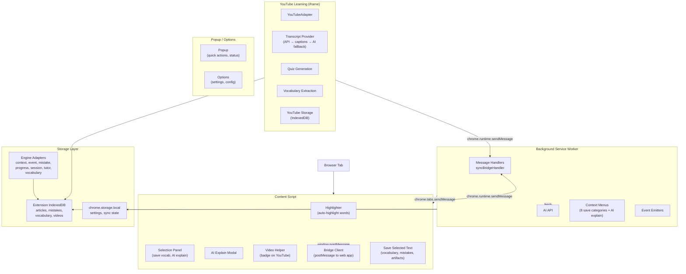
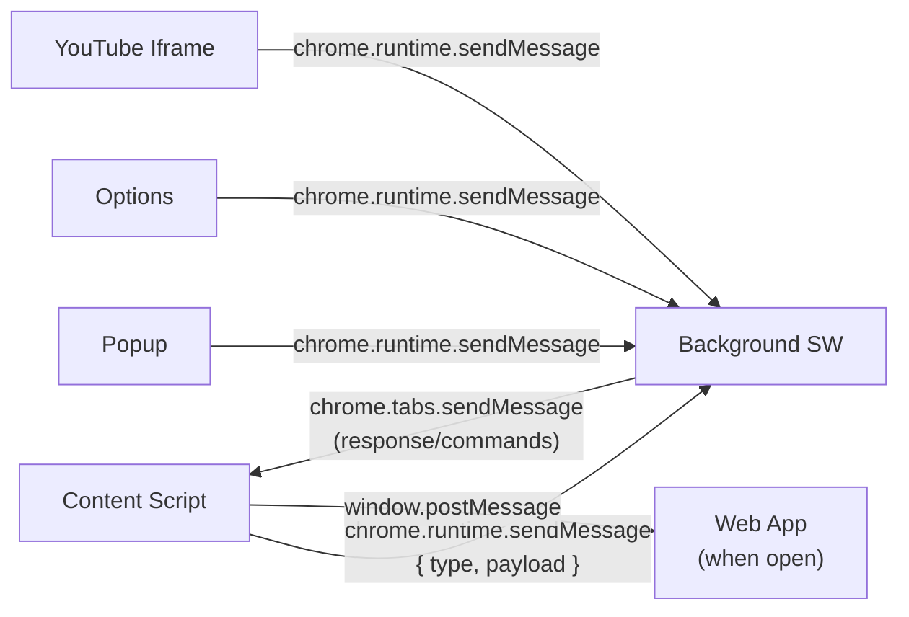

# Chrome Extension Architecture

## Tech Stack

| Technology | Version | Purpose |
|---|---|---|
| Manifest | V3 | Extension platform |
| React | 19 | Popup, Options, YouTube Learning UI |
| Vite | 6 | Build for HTML pages (popup, options, YouTube) |
| esbuild | — | Build for background + content scripts (bundled) |
| Dexie | 4 | Extension-side IndexedDB |
| React Router | 7 | YouTube Learning routing |
| Zod | 4 | Data validation |

## Build Pipeline

```
scripts/build.mjs
├── 1. Vite build → popup/, options/, youtube-learning/ HTML+JS
├── 2. Copy manifest.json → dist/
├── 3. esbuild (bundle, esm, es2020):
│   ├── src/background/index.ts → dist/background.js
│   └── src/content-script/index.ts → dist/content.js
└── 4. Copy icons from public/icons/ → dist/icons/
```

## Architecture Diagram



## Components

### Background Service Worker

Entry: `src/background/index.ts`

- **Context Menus**: 8 save categories (vocabulary, mistake, reading, listening, writing, speaking, grammar, artifact) + AI explain. Created on `chrome.runtime.onInstalled`.
- **Message Handlers**: `syncBridgeHandler.ts` — receives messages from content script and popup, coordinates storage and AI calls.
- **AI Service**: `ai-service.ts` — thin wrapper around `@ielts/ai.callAI` for AI explain and enrichment.
- **Event Emitters**: `eventEmitters.ts` — extension-level event notifications.
- **Settings Storage**: `settingsStorage.ts` — read/write extension settings.

### Content Script

Entry: `src/content-script/index.ts`

- **Highlighter**: `highlighter/` — auto-highlights IELTS-relevant vocabulary on any webpage, with tooltip definitions.
- **Selection Panel**: `selectionPanel.ts` — floating panel on text selection with save/AI explain actions.
- **AI Explain**: `aiExplain.ts` — modal that calls the AI to explain selected text.
- **Video Helper**: `videoHelper.ts` — badge injected on YouTube video pages indicating IELTS learning integration.
- **Bridge Client**: `bridge-client.ts` — establishes `postMessage` connection to the web app when both are open.
- **Save Selected Text**: `saveSelectedText.ts` — captures selection and routes to appropriate storage.
- **Vocabulary Save Handler**: `vocabularySaveHandler.ts` — specialized handler for vocab items.
- **Article Extractor**: `articleExtractor.ts` — extracts article content for reading practice.
- **Mini Tutor**: `miniTutor.ts` — lightweight AI tutor interaction within the page.

### YouTube Learning

Entry: `src/youtube-learning/` — layered architecture

| Layer | Directory | Responsibility |
|---|---|---|
| Infrastructure | `infrastructure/` | YouTube API adapter, transcript providers (API, captions, AI fallback), persistence |
| Application | `application/` | Quiz generation, vocabulary extraction orchestration |
| Domain | `domain/` | Entities (video, transcript, exercise), events, repositories, value objects |
| Presentation | `presentation/` | React UI: video player, quiz interface, vocab list, study session controls |
| Entry | `main.tsx`, `App.tsx` | Mounts the YouTube learning iframe app, routes |
| Types | `types.ts` | Type definitions |

### Popup

Entry: `src/popup/`

- Quick access to recent saves, today's vocabulary, search, and link to web app.

### Options

Entry: `src/options/`

- Extension settings: AI provider config, auto-highlight toggle, sync preferences, notification settings.

## Messaging Architecture



- All background interactions use `chrome.runtime.sendMessage` with typed payloads
- Extension-to-web-app sync uses `window.postMessage` with `DATA_SYNC_ACTION` protocol from `@ielts/storage/syncProtocol`
- Content script → web app bridge: `bridge-client.ts` listens for web app presence

## Dual Storage Strategy

| Storage | Purpose | Scope |
|---|---|---|
| **IndexedDB** (extension) | User data: saved articles, vocabulary, mistakes, videos, study sessions | Extension origin |
| **chrome.storage.local** | Extension settings, small state, sync metadata | Extension origin |

The extension maintains its own IndexedDB independent of the web app. Engine adapters at `src/storage/engine-adapters/` provide implementations of `@ielts/ai-tutor-engine` and `@ielts/learning-engine` port interfaces for the extension's IndexedDB.

When the web app tab is detected via `postMessage`, the sync bridge forwards new items from the extension's DB to the web app's DB. This is a one-way, best-effort push — there is no two-way conflict resolution.
