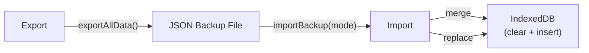
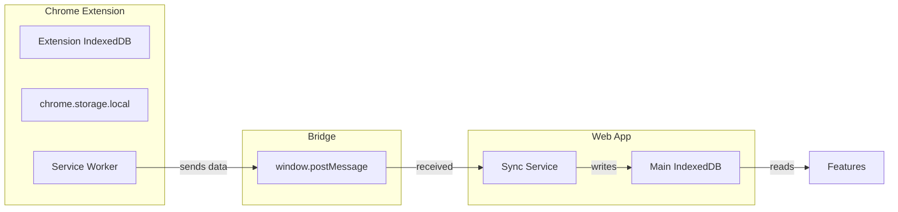

# Local-First Architecture

## Design Philosophy

IELTS Journey is a **local-first** application — there is no backend server. All user data resides in the browser, and the user owns their AI API key. This design prioritizes privacy, offline availability, and zero infrastructure costs.

## Data Storage

```
Browser
├── IndexedDB (Dexie) ← Primary data store
│   ├── 47 tables across v1-v8 migrations
│   ├── All learning data: vocabulary, tasks, sessions,
│   │   mistakes, mock tests, progress, AI chat, exercises
│   └── YouTube-specific: transcripts, quizzes, study sessions
│
├── localStorage
│   ├── Settings (ielts-settings key)
│   ├── AI tutor config (ielts-ai-tutor-engine key)
│   ├── Tutor memory (tutor-memory-* keys)
│   └── Schema version tracking
│
└── Service Worker Cache (via vite-plugin-pwa)
    ├── App shell (HTML, JS, CSS)
    └── Static assets
```

## AI Key Ownership

The user's AI provider key (OpenAI or custom endpoint) is stored in `localStorage` under `ielts-settings`. It is never sent to any server other than the configured AI API endpoint. If no key is configured, AI features gracefully degrade — deterministic grading still works, and the app remains fully functional.

## Offline Support

- **PWA service worker** caches the app shell, allowing full reload while offline
- **IndexedDB** is available offline by definition — all CRUD operations work without connectivity
- **AI features** require a network connection to the AI provider; offline fallbacks include deterministic grading and previously cached AI responses
- **Extension content scripts** work offline for highlighting, saving, and local storage

## Backup and Restore



- Export dumps all IndexedDB tables to a single JSON blob
- Import supports **merge** (upsert by ID) and **replace** (clear all then insert) modes
- Backup is user-initiated from Settings > Import/Export

## Extension ↔ Web Sync



The extension runs an independent IndexedDB instance. When the web app tab is open, items saved from the extension are forwarded via `window.postMessage` to the web app's sync service, which writes them into the main database. This is a one-way, best-effort sync — there is no conflict resolution, no replication protocol, and no cloud-based sync.

## Limitations

| Limitation | Detail |
|---|---|
| **No cloud sync** | Data is tied to a single browser. Clearing browser data destroys all progress. Export/import is the only backup mechanism. |
| **No multi-device** | Each device/browser has an independent database. No user accounts, no cross-device synchronization. |
| **Extension isolation** | Extension and web app maintain separate IndexedDB instances. Sync only works when both are open and requires the bridge to be active. |
| **AI reliance** | Without an API key, AI-powered features (writing evaluation, speaking feedback, AI tutor chat, proactive messages) are unavailable. Deterministic features continue to work. |
| **Storage limits** | IndexedDB has per-origin storage limits (~80% of disk on most browsers). Large numbers of AI chat sessions or video transcripts may approach limits. |
