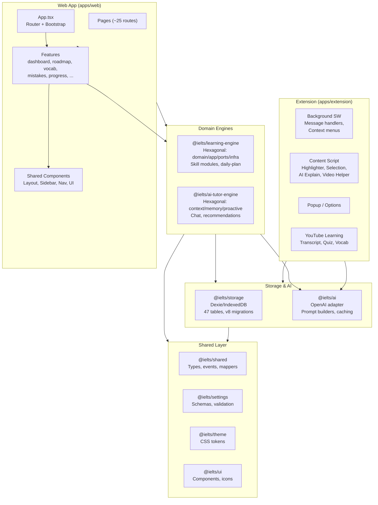
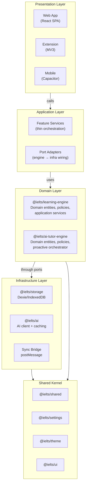
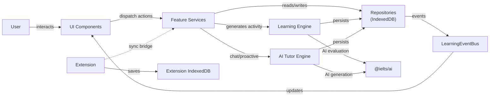

# Architecture Overview

## Current Architecture

IELTS Journey is a **local-first, offline-capable** IELTS preparation application. It has no backend server — all data lives in the user's browser (IndexedDB) and the AI API key is owned and configured by the user. The monorepo contains two main applications (web app and Chrome extension) and eight shared packages.

The web app is a **React 19** SPA built with **Vite 6**, styled with **Tailwind v4**, and wrapped as a native mobile app via **Capacitor 8**. The Chrome extension follows **MV3** with a service worker background, content scripts, and a popup/options interface.

Two domain engines — **@ielts/learning-engine** and **@ielts/ai-tutor-engine** — provide structured hexagonal architectures for learning activities and AI tutoring respectively. They are bootstrapped in the web app at startup and wired to IndexedDB repositories via adapter implementations in `engineBootstrap.ts`.

## Application Boundaries

```
┌─────────────────────────────────────────────────────────┐
│                     Web App (apps/web)                    │
│  React 19 SPA  │  PWA  │  Capacitor 8  │  Tailwind v4   │
│                                                          │
│  Features: dashboard, roadmap, practice pages, vocab,    │
│  mistakes, mock-tests, progress, settings, AI tutor,     │
│  onboarding, search, artifacts, books, review center     │
├─────────────────────────────────────────────────────────┤
│                  Extension (apps/extension)               │
│  MV3 Service Worker  │  Content Scripts  │  Popup/Options│
│  YouTube Learning  │  Context Menus  │  Selection Panel  │
├─────────────────────────────────────────────────────────┤
│                    Feature Packages                       │
│  @ielts/learning-engine  │  @ielts/ai-tutor-engine       │
│  @ielts/ai  │  @ielts/storage  │  @ielts/shared          │
│  @ielts/settings  │  @ielts/theme  │  @ielts/ui           │
└─────────────────────────────────────────────────────────┘
```

## Package Boundaries

| Package | Scope | Key Exports |
|---|---|---|
| `@ielts/learning-engine` | Learning activities, sessions, exercises, evaluation | `createLearningEngine`, skill modules, ports |
| `@ielts/ai-tutor-engine` | AI chat, proactive tutoring, memory, recommendations | `createAITutorEngine`, `ProactiveTutorOrchestrator` |
| `@ielts/ai` | AI client, prompt registry, caching | `callAI`, `createAIClient`, `PromptRegistry` |
| `@ielts/storage` | IndexedDB schema, migrations, repositories | `APP_SCHEMA`, `initDb`, repository classes, backup utils |
| `@ielts/shared` | Shared domain types and mappers | `IELTSSection`, event types, evaluation types |
| `@ielts/settings` | Settings schema and validation | Zod schemas for user settings |
| `@ielts/theme` | Theme tokens and React context | CSS variables, theme provider |
| `@ielts/ui` | Shared UI components and icons | 22 components, 180 lucide-react icons |

## Current Architecture Diagram



## Target Architecture Diagram



## Data Flow



## Current Architectural Problems

1. **Duplicate models**: The web app defines its own data models (in `apps/web/src/models/`, `apps/web/src/data/`) that overlap with types in `@ielts/shared` and the engine domain entities. There is no single source of truth for shared types.

2. **Fragmented exercise generation**: Some practice pages generate exercises with hardcoded logic in the component layer, while the learning engine provides structured skill modules (reading, writing, etc.) for the same purpose. This creates inconsistency — exercises from the learning engine flow through the engine pipeline with evaluation and progress tracking, while component-generated exercises bypass it entirely.

3. **Partial engine adoption**: The `engineBootstrap.ts` wires both engines to IndexedDB via adapter functions, but many feature pages still access storage repositories directly (`DatabaseService.safeGetAll`) rather than going through engine ports. The engines are available but not universally adopted.

4. **Mixed concerns in the web app**: The web app directly imports `@ielts/storage` repositories and calls Dexie queries inline in feature code, rather than routing all data access through the engine port interfaces. This couples UI code to storage implementation details.

5. **Inconsistent event flow**: The `LearningEventBus` publishes events within the web app, and the engine has its own `LearningEventPublisher` port — but not all state changes are published as events, and consumers (progress tracking, proactive tutor) have incomplete visibility into user actions.
