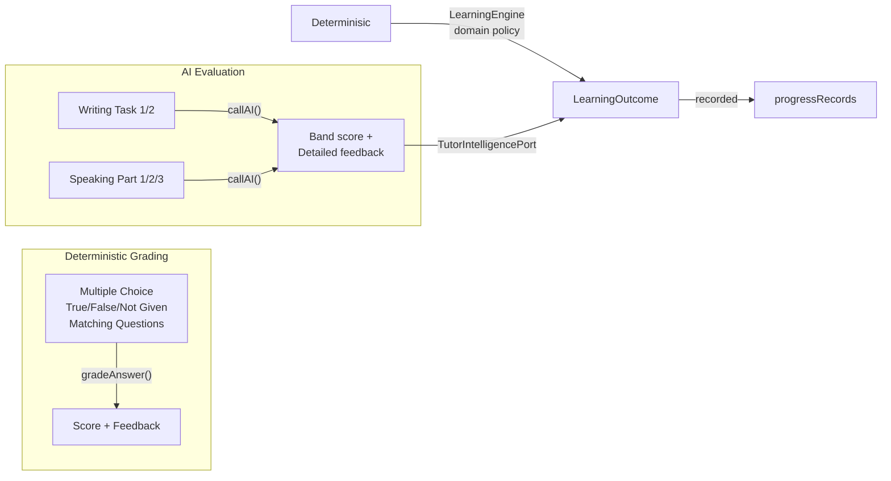
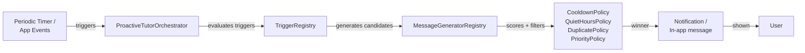

# Runtime Data Flows

## Roadmap Task → Learning Completion

```
User views roadmap → FullStudyRoadmapPage
  → reads tasks from IndexedDB (tasks table)
  → clicks a task (e.g., "Reading Passage 1")
  → navigates to practice page (/reading)

Practice page (ReadingPracticePage)
  → loads exercise content
  → user submits answers
  → evaluates via deterministic grading (MC/TFNG)
  → records progress:
      → LearningEngine.recordLearningOutcome()
      → OR directly writes to progressRecords table
  → marks task done:
      → StudyPlanPort.markTaskFulfilled()
      → updates tasks table (isDone, completedAt, accuracy)
  → publishes event:
      → LearningEventBus.publish('learning_session_completed')
```

## Exercise Generation

### Current (component-driven)

```
ReadingPracticePage
  → hardcoded exercise JSX (passages, MC questions)
  → no connection to learning engine skill modules
  → evaluation done inline with local grading logic
  → progress recorded directly to IndexedDB
```

### Target (engine-driven)

```
User starts practice
  → LearningEngine.generateLearningActivity(skill, context)
  → SkillModule (e.g., ReadingSkillModule)
      → generates/selects exercises via domain policies
      → returns structured LearningActivity
  → PracticePage renders activity
  → User submits → submitAnswer()
  → Evaluation via domain policies (deterministic) or AI (open-response)
  → Outcome persisted → progress tracking updated
```

## Answer Evaluation



- **MC/TFNG/Matching**: Graded by `deterministicGrader.ts` in the learning engine's domain policies. Instant, no AI needed.
- **Writing/Speaking**: Evaluated via `@ielts/ai` (`callAI`) through the `TutorIntelligencePort` (learning engine) or `TutorAIClient` (AI tutor engine). Requires user-configured API key.
- **Vocabulary/Grammar**: Mixed — some exercises use deterministic checks, others request AI enrichment.

## AI Tutor Chat

```
ChatWidget (floating icon on every page)
  → user sends message
  → engineBootstrap.ts → AITutorEngine.sendTutorMessage()
      → builds learner context (LearnerContextBuilder)
      → calls TutorAIClient.generateStructured(request)
      → TutorAIClient.callAI() → @ielts/ai.callAI()
      → OpenAI API → structured response
  → message stored in aiContents table (via messageRepository)
  → response rendered in chat widget

TutorAIClient implementation (engineBootstrap.ts):
  callAI(systemPrompt, userMessage, opts)
    → @ielts/ai.callAI(prompt, message, { temperature, maxTokens })
    → parses JSON from response
    → returns { success, data/error }
```

## Proactive Messages



```
ProactiveTutorOrchestrator.evaluate()
  → TriggerRegistry.getActiveTriggers()
      → inactivity, low progress, exam near, mistakes piling up, etc.
  → MessageGeneratorRegistry.generateCandidates()
      → creates proactive messages (reminders, encouragement, tips)
  → Scoring + filtering:
      → CooldownPolicy (min interval, max per day)
      → QuietHoursPolicy (respect quiet hours config)
      → DuplicatePolicy (avoid repeating same message)
      → RecommendationPriorityPolicy (score by urgency/impact)
  → Best message(s) delivered via:
      → In-app notification (Web App)
      → Chrome notification (Extension - if enabled)
  → User engagement → cooldown updated
```

## YouTube Learning

```
Content Script detects YouTube video page
  → YouTubeAdapter initializes
  → Injects YouTube learning iframe + helper badge

User opens YouTube Learning panel
  → TranscriptProvider fetches transcript
      → Strategy: API first → caption track fallback → AI generation
  → Transcript sent to AI:
      → @ielts/ai.callAI → generates quiz questions
      → @ielts/ai.callAI → extracts vocabulary (word, definition, example)
  → Results stored in IndexedDB:
      → transcripts, youtubeExercises, videoVocabularySources
  → User can:
      → Take quizzes (deterministic grading)
      → Save vocabulary to main vocab notebook
      → Review via YouTube Learning UI
```

## Extension Save Flow

```
Context Menu (user selects text → right-click → "Save to IELTS")
  → Context menu handler (background/index.ts)
  → Identifies category: vocabulary, mistake, reading, listening,
    writing, speaking, grammar, artifact
  → Saves to:
      → Chrome Extension IndexedDB (local copy)
      → chrome.storage.local (for sync bridge)
  → If web app is open:
      → postMessage bridge → web app sync service
      → Item saved to main IndexedDB
```

```
Content Script Selection Panel:
  User selects text → floating panel appears
    → "Save to Vocabulary" / "AI Explain" / "Save as Artifact"
    → saveSelectedText.ts → background handler → IndexedDB
    → AI Explain → callAI → explanation modal
```
