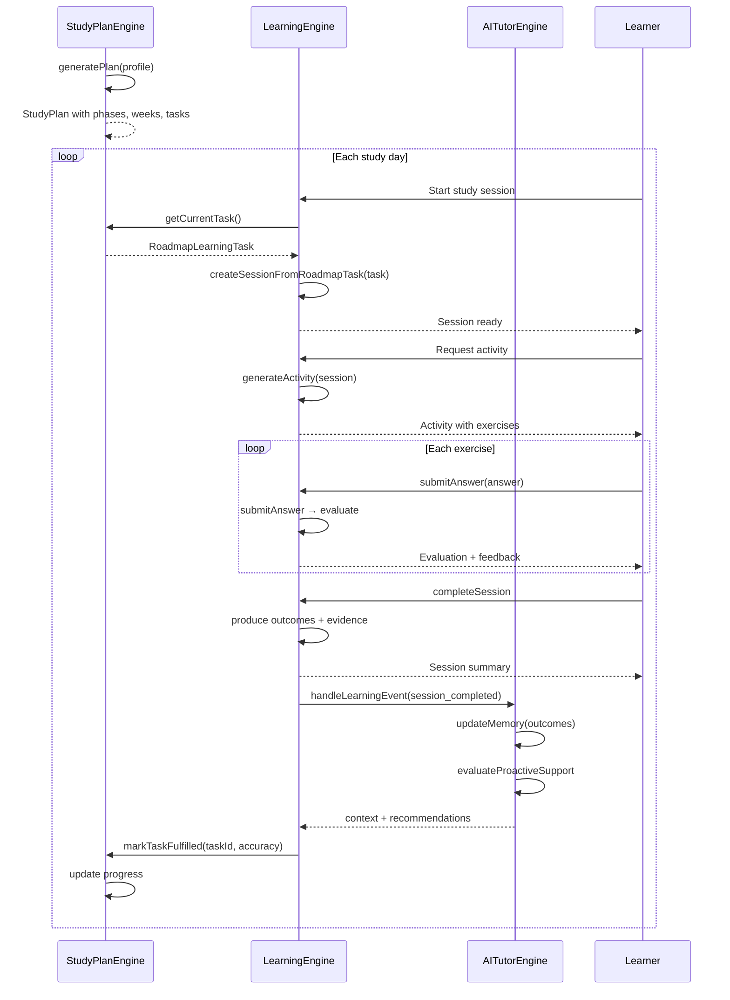

# Engine Integration

## Intended Interaction Flow

```
┌──────────────────┐     schedules      ┌──────────────────────┐
│                  │  ────────────────>  │                      │
│  Study Plan      │                    │  Learning Engine     │
│  Engine          │                    │                      │
│  (DailyPlanEng)  │  roadmap tasks     │  createSession       │
│                  │  ────────────────>  │  generateActivity    │
│   generatePlan   │                    │  submitAnswer        │
│   regenerate     │                    │  completeSession     │
│   adaptToMissed  │                    │                      │
│                  │                    │  produces outcomes   │
│                  │                    │       │              │
└──────────────────┘                    └───────┼──────────────┘
        ▲                                       │
        │                           outcomes / events
        │                                       │
        │                              ┌────────▼──────────┐
        │                              │                   │
        │       progress updates       │  AI Tutor Engine  │
        ├──────────────────────────────│                   │
        │                              │  handleLearningEvt│
        │                              │  updateMemory     │
        │                              │  sendTutorMessage │
        │                              │  evaluateProactiv │
        │                              │                   │
        │                              └───────────────────┘
        │                                       │
        │                              context / memory
        │                                       │
        └───────────────────────────────────────┘
```

## Mermaid Sequence Diagram



## Current Integration State

### What Works

| Integration | Status | Location |
|---|---|---|
| Learning Engine reads study plan tasks | Partial | `engineBootstrap.ts:517-531` — `StudyPlanPort.getCurrentTask` returns `null` |
| Learning Engine marks tasks fulfilled | Partial | `engineBootstrap.ts:520-531` — writes to `DatabaseService` but `studyPlanPort` is a stub |
| Learning Engine publishes events | Basic | `engineBootstrap.ts:192-218` — publishes to `DatabaseService` and duplicates to `progressRecords` |
| AITutor Engine handles learning events | Basic | `engine-impl.ts:164-217` — maps event type to memory updates, triggers proactive |
| LearnerContext flows to Tutor Engine | Partial | `engineBootstrap.ts:284-403` — all 9 context sources wired, but use localStorage/IndexedDB directly |
| LearnerContext flows to Learning Engine | Minimal | `engineBootstrap.ts:444-465` — returns hardcoded minimal context |
| Spaced repetition review scheduling | Done | `DailyPlanEngine.ts:1264` — adds review tasks at intervals |
| Difficulty adaptation | Done | `engine-impl.ts:272-285` — adapts based on accuracy + streak |

### What's Missing

| Integration | Gap | Target |
|---|---|---|
| Learning Engine → Tutor Engine event bus | Events published but not consumed by Tutor Engine's `handleLearningEvent` in some flows | All session completions fire events via `eventPublisher` + `handleLearningEvent` |
| Tutor Engine → Learning Engine recommendations | `getRecommendedActivity` is independent, doesn't call Tutor Engine | `getRecommendedActivity` calls Tutor Engine's `getNextBestAction` |
| Study Plan progress updates from outcomes | `progressRepository` is a stub (empty `{}` returns) | Full progress sync: outcome → skill progress → study plan |
| Context sharing | Learning Engine has its own `LearnerContextPort` that returns minimal context; Tutor Engine has its own `LearnerContextBuilder` | Shared context through `@ielts/shared` types, one source of truth |
| Cross-engine session state | Learning Engine sessions are independent of Tutor Engine chat sessions | Unified session model |

## Ownership Boundaries

| Component | Owns | Consumes |
|---|---|---|
| Study Plan Engine | Schedule structure, task definitions, phase progression, feasibility | Profile data, AI enrichment (optional) |
| Learning Engine | Session lifecycle, exercise generation, answer evaluation, outcome production | Learner context, tutor intelligence (AI), study plan tasks |
| AI Tutor Engine | Chat conversations, proactive messages, memory, context, progress reviews | Learner state snapshot, AI client, repository data |
| `@ielts/ai` | OpenAI communication, prompt building, caching, Zod schemas | API configuration |

## Shared Types (`@ielts/shared`)

Cross-engine types in `packages/shared/src/`:

- `LearnerContext` — union of profile, progress, mistakes, vocabulary, activity, preferences, constraints
- `IELTSSection` — `listening | reading | writing | speaking`
- `AnswerEvaluation` — evaluation results
- `MistakeEvidence` — mistaken patterns
- `LearningOutcome` — session outcomes

## Target Full Integration

```
┌──────────────────────────────────────────────────────────┐
│                    Shared Context Bus                     │
│  (LearnerContext ← study-plan progress + session         │
│   outcomes + tutor memory → context for next session)     │
├──────────────────────────────────────────────────────────┤
│                                                          │
│  StudyPlanEngine → LearningEngine → AITutorEngine        │
│       │                │                │                │
│       └──── progress ──┴── outcomes ────┤                │
│                                          │                │
│       ┌──────── context ────────────────┘                │
│       │                                                   │
│       └──────── next-recommendation ──────────────────┘  │
│                                                          │
└──────────────────────────────────────────────────────────┘
```

The target state enables:

1. **Bidirectional event flow** — every session outcome updates both study plan progress and tutor memory
2. **Unified context** — one `LearnerContext` built from consistent sources, consumed by both engines
3. **Recommendation loop** — study plan recommends tasks → learning engine creates sessions → outcomes → tutor engine refines context → recommendations improve
4. **Proactive trigger from learning events** — session completion, mistake patterns, and progress milestones trigger tutor interventions automatically
5. **Seamless offline** — both engines degrade gracefully when AI is unavailable; study plan engine works fully offline, learning engine uses deterministic grading, tutor engine returns unavailable status
