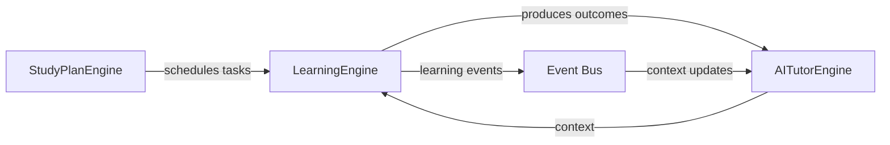

# Target Architecture

## High-Level Architecture

```mermaid
graph TB
    subgraph Consumers
        WEB[apps/web]
        EXT[apps/extension]
    end

    subgraph Ports
        direction LR
        LE_PORT[LearningEngine Port]
        AT_PORT[AITutorEngine Port]
        SP_PORT[StudyPlan Port]
    end

    subgraph Engines
        LE[LearningEngine\n@ielts/learning-engine]
        AT[AITutorEngine\n@ielts/ai-tutor-engine]
        SP[StudyPlanEngine\n@ielts/learning-engine\n(daily-plan/)]
    end

    subgraph Shared
        SHARED[@ielts/shared\nDomain types]
        AI[@ielts/ai\nAI Adapter Layer]
        STORAGE[@ielts/storage\nAll persistence]
        EVENTS[Shared Events]
    end

    WEB --> LE_PORT
    WEB --> AT_PORT
    WEB --> SP_PORT
    EXT --> LE_PORT
    EXT --> AT_PORT
    EXT --> SP_PORT

    LE_PORT --> LE
    AT_PORT --> AT
    SP_PORT --> SP

    LE --> SHARED
    AT --> SHARED
    SP --> SHARED
    LE --> AI
    AT --> AI
    SP --> AI
    LE --> STORAGE
    AT --> STORAGE
    SP --> STORAGE
    LE -.->|emits| EVENTS
    AT -.->|emits| EVENTS
    EVENTS -.->|consumes| AT
```

## Engine-to-Engine Flow



## Package Dependency Direction

```mermaid
graph BT
    WEB[apps/web] --> LE[@ielts/learning-engine]
    WEB --> AT[@ielts/ai-tutor-engine]
    WEB --> AI[@ielts/ai]
    WEB --> S[@ielts/storage]
    EXT[apps/extension] --> LE
    EXT --> AT
    EXT --> S
    LE --> SH[@ielts/shared]
    LE --> AI
    AT --> SH
    AT --> AI
    SP[daily-plan/] --> SH
```

## Key Principles

### 1. Single Source of Truth

- **Exercise model**: `ExerciseQuestion` defined in `@ielts/shared`, consumed by all engines and storage.
- **AI calls**: Only `@ielts/ai`'s `callAI` or engine wrappers that use it internally.
- **Persistence**: Only `@ielts/storage` with Dexie-backed repositories.

### 2. Hexagonal Engines

Each engine (`LearningEngine`, `AITutorEngine`, `StudyPlanEngine`) has:
- **Ports** (interfaces in `ports/` directory) — what the engine needs from the outside world.
- **Domain** (entities, value objects, policies) — pure business logic with no I/O.
- **Application** (use cases) — orchestration of domain logic.
- **Infrastructure** (adapters) — implementation of ports.

### 3. Pure Consumers

`apps/web` and `apps/extension` never:
- Define their own exercise models.
- Call AI providers directly.
- Create their own database tables.
- Duplicate engine logic (exercise generation, evaluation, feedback).

### 4. Events for Cross-Cutting Concerns

Learning events flow from `LearningEngine` → event bus → `AITutorEngine`. This enables:
- Progress tracking without tight coupling.
- Proactive tutoring based on learning outcomes.
- Context updates across engine boundaries.
